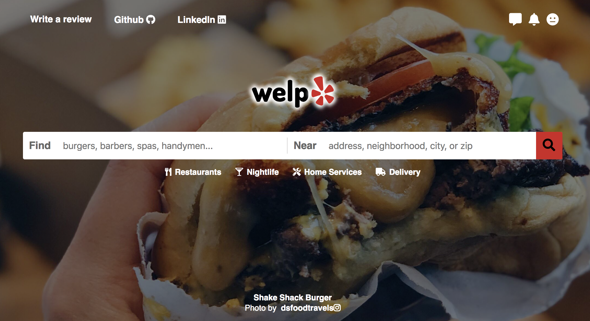
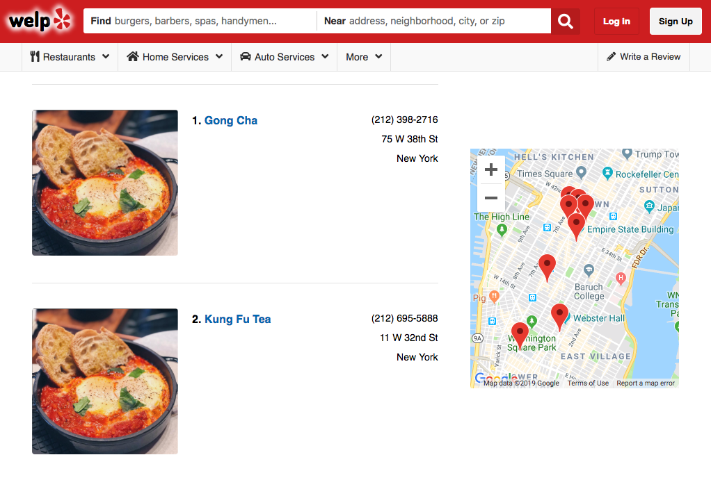
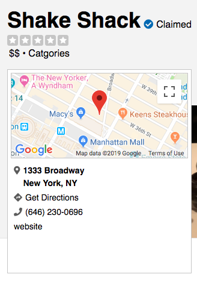
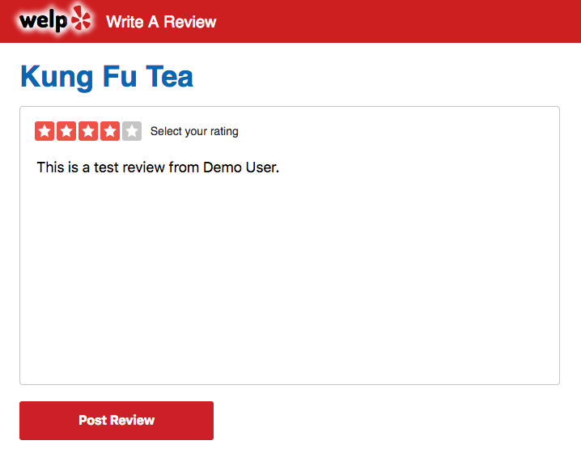
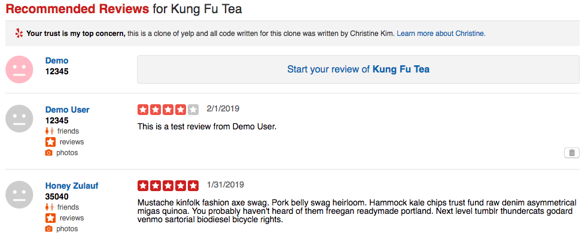

# welp

[welp live](https://welp-ck.herokuapp.com/#/)

Welp is a clone of Yelp that allows users to look at local businesses. A user can see a list of businesses and see more detailed information about each business. The user can see reviews from other users and also create and delete their own reviews.




## Feature Highlights

### Google Map API
When on the business index page, users are able to see markers on the map of each business. Once user clicks into business show page, google map zooms in and centers on that business's location.


>  Business index page has multiple markers showing all businesses on index page


> Business show page had a map with only the one marker for the business

Map is one component that renders differently based on being business index or show page.

``` javascript
componentDidMount() {
    let mapOptions;
    if (this.props.singleBusiness) {
      const { business } = this.props;
      const position = new google.maps.LatLng(business.latitude, business.longitude);
      mapOptions = {
        center: position,
        zoom: 15
      };
    } else {
      mapOptions= {
        center: { lat: 40.742829, lng: -73.986679 },
        zoom: 13,
        zoomControl: true,
        zoomControlOptions: {
          position: google.maps.ControlPosition.LEFT_TOP,
          style: google.maps.ZoomControlStyle.HORIZONTAL,
        },
        mapTypeControl: false,
        streetViewControl: false,
        fullscreenControl: false
      };
    }

    const mapNode = this.refs.map;
    this.map = new google.maps.Map(mapNode, mapOptions);
    this.MarkerManager = new MarkerManager(this.map);

    if (this.props.singleBusiness) {
      this.props.fetchBusiness(this.props.business.id);
    } else {
      this.MarkerManager.updateMarkers(this.props.businesses);
    }
  }
```

### Reviews
Part of welp's appeal and primary purpose of welp is the ability to write & view reviews of a business. Once submitted successfully, user get redirected to the business show page with their review on the page.


> Star rating translates to a number which is attached to the review


> Users can only delete their own reviews, their is no option to delete others reviews.

## Technologies Used
+ Ruby on Rails
+ PostgreSQL
+ React.js and Redux
+ HTML and CSS

## Future Implementations
WIP features inlude:
+ Search bar
+ Updating reviews
+ User profile
+ Add pictures to reviews/business pages